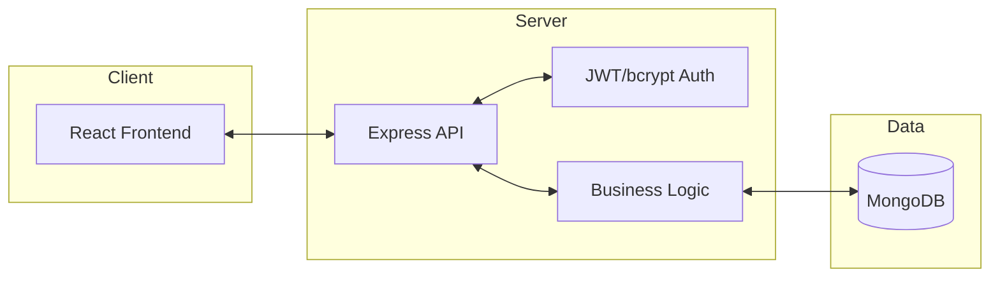

# 🎓 Online Quiz & Examination System
> **A Professional Final Year Project Portfolio Piece**

[](https://nodejs.org/)
[](https://reactjs.org/)
[](https://www.mongodb.com/)
[](https://tailwindcss.com/)

An advanced, full-stack examination platform designed to manage academic assessments with real-time monitoring, automated grading, and secure role-based access.

---

## 🌟 Key Features

### 👨‍💼 Admin Dashboard (System Control)
- **User Management**: Register, audit, and manage Teachers and Students.
- **Class Organization**: Create academic classes and assign subjects.
- **System Reports**: High-level analytics of system usage and performance.

### 👩‍🏫 Teacher Suite (Assessment Management)
- **Quiz Creator**: Dynamic quiz builder supporting MCQ, True/False, and Short Answer.
- **Live Monitoring**: Real-time dashboard to track student status and progress during exams.
- **Smart Grading**: Automated grading for objective questions; manual board for short answers.
- **Export Tools**: Generate and download class gradebooks in CSV format.

### 👨‍🎓 Student Portal (Examination Experience)
- **Secure Entry**: Room code verification against a roster-checked ID system.
- **Timed Exams**: Clean interface with auto-submission and countdown timers.
- **Instant Feedback**: View scores and detailed results (teacher-configurable).

---

## 🏗️ Technical Architecture

The system is built on a modern **RESTful Architecture** with complete separation of concerns.



### Backend (Node.js/Express)
- **Security**: JWT-based session management and bcrypt password hashing.
- **Integrity**: Mongoose pre/post hooks for automated calculations and data cleanup.
- **Robustness**: Centralized error handling and atomic sequential ID generation.

### Frontend (React/Tailwind)
- **UX**: Framer Motion for smooth transitions and a custom "Purple Theme" aesthetic.
- **State**: Context API for global theme switching and auth persistence.
- **Responsive**: Fully optimized for desktop and tablet viewports.

---

## 🚀 Deployment & Quick Start

### 1. Repository Structure
```text
.
├── backend-nodejs/    # Express.js Server & MongoDB Models
└── frontend-nodejs/   # React.js Client & Tailwind Styling
```

### 2. Backend Setup
```bash
cd backend-nodejs
npm install
# Create .env file with MONGODB_URI and JWT_SECRET
npm run dev
```

### 3. Frontend Setup
```bash
cd frontend-nodejs
npm install
npm run dev
```

---

## 🛡️ Requirements Compliance
This project strictly follows the **Department of Computer Science** guidelines for technical implementation, security, and architectural integrity.

- [x] Separation of Frontend/Backend
- [x] RESTful API Design
- [x] JWT Authentication & Role-Based Access
- [x] Mongoose Hooks & Pre-save Encryption
- [x] Detailed Documentation & READMEs

